Employee Dashboard
==================

David Kurtz * david@scelerat.com

## Orientation

The frontend is a [svelte/sveltekit](https://svelte.dev/) app. There is one 
page in the app which displays and employee dashboard and the ability to 
edit, update, add, and delete employees. Two of the components are reused,
[DepartmentDropDown.svelte](frontend/src/lib/components/DepartmentDropDown.svelte) and [EditUserDialog.svelte](frontend/src/lib/components/EditUserDialog.svelte). I used the [shadcn-svelte](https://www.shadcn-svelte.com/)
component library/builder as a basis for many ui pieces. Unlike many other ui
component libraries, shadcn will create the component code for you, enabling
more flexibility to modify core components, rather than simply being a node 
module. You can see the shadcn-generated components in the [`frontend/src/lib/components/ui`](frontend/src/lib/components/ui) 
directory. It turns out I didn't do any customization of these core modules. 
shadcn also relies on TailwindCSS and your will see its use throughout the 
components and layouts.

A very half-hearted attempt was made at validations using the [zod validation
library](https://zod.dev/). There are some nifty integrations possible with 
zod and shadcn, but I ended up just rolling my own-one off solution for
highlighting form errors in [EditUserDialog.svelte](frontend/src/lib/components/EditUserDialog.svelte#L29-L35). Mostly a time issue.

This was my first time working with svelte, and a probably burned more time 
than I should have learning the ins and outs of its reactivity paradigm.

The backend is a node express app which makes use of the [kysely query 
framework](https://kysely.dev/). Use of this framework makes it easier to 
define and conform to database types as well as provide migration and 
seed scripts.

## Setup

### Backend

    cd backend
  
#### Install npm

Install nvm via your favorite package manager (if necessary), then:

    nvm install    # will install the version of node found in .nvmrc
    nvm use        # will use the version of node found in .nvmrc

#### Install Node Modules

    npm install

#### Create .env

Create a copy of `env.example` and name it `.env`
Sensitive environment-specific variables will be stored here, such as
database name, user, and password

    cp env.example .env

#### Database

Install and run postgresql (if necessary)

    createdb dk-theta-employee-info # remember this database name; you will place it in .env

Replace the dummy values in .env with the database name, user and password you used to create it.

Now run migrations:

    npx tsx database/migrate.ts

Seed the database with initial values

    npx tsx database/seed.ts

#### API Server

Run the api server. It will be served on the port specified by `PORT` in .env

    npx tsx index.ts

### Frontend

    cd frontend   # as appropriate depending on your cwd

#### nvm

    nvm use

#### npm

    npm install

#### Environment variables

Copy the contents of env.example to .env

    cp env.example .env

Set `PUBLIC_API_PORT` to the same value as you did for `PORT` in backend/.env

#### Running the frontend server

    npm run dev

## Screenshots

### Main Table

The main table view shows all the information about an employee except for their bio. On narrow screens, several columns are hidden by CSS (but still sent by the server/pesent in the DOM)

#### Full-width
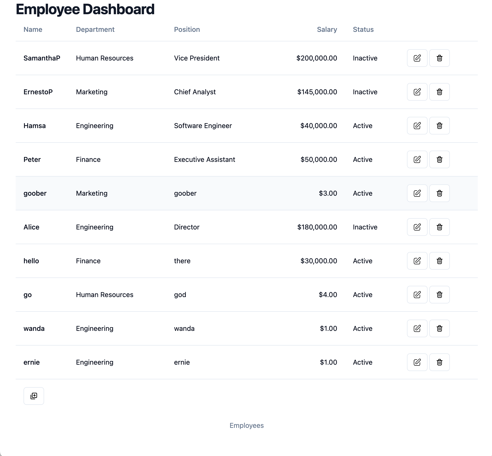

#### Narrow viewport

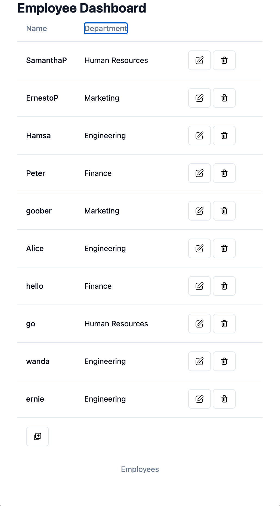

#### Drop-down menus

There are two drop down menus which select a subset of the data, department and status. These filters are additive, so if you choose to filter on one, and then the other, they will both be in effect at the same time.

##### Status drop down menu

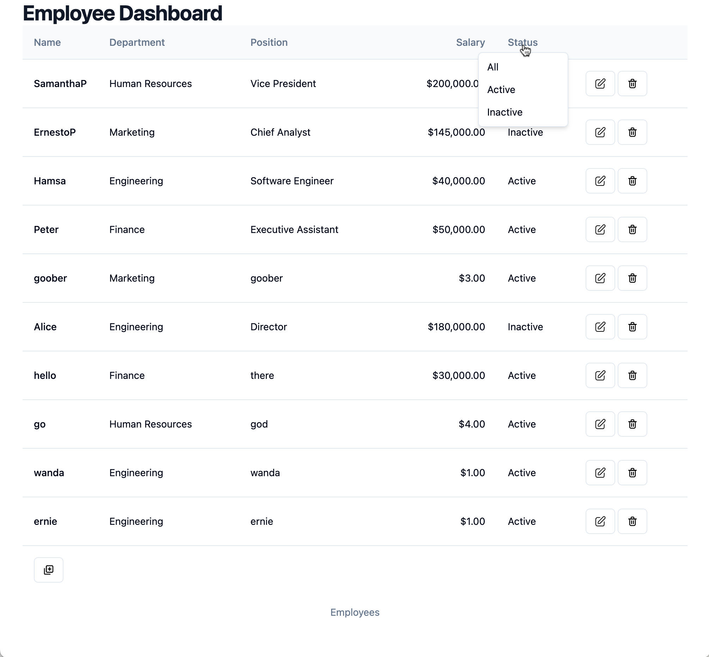

##### Department Drop-down and filter

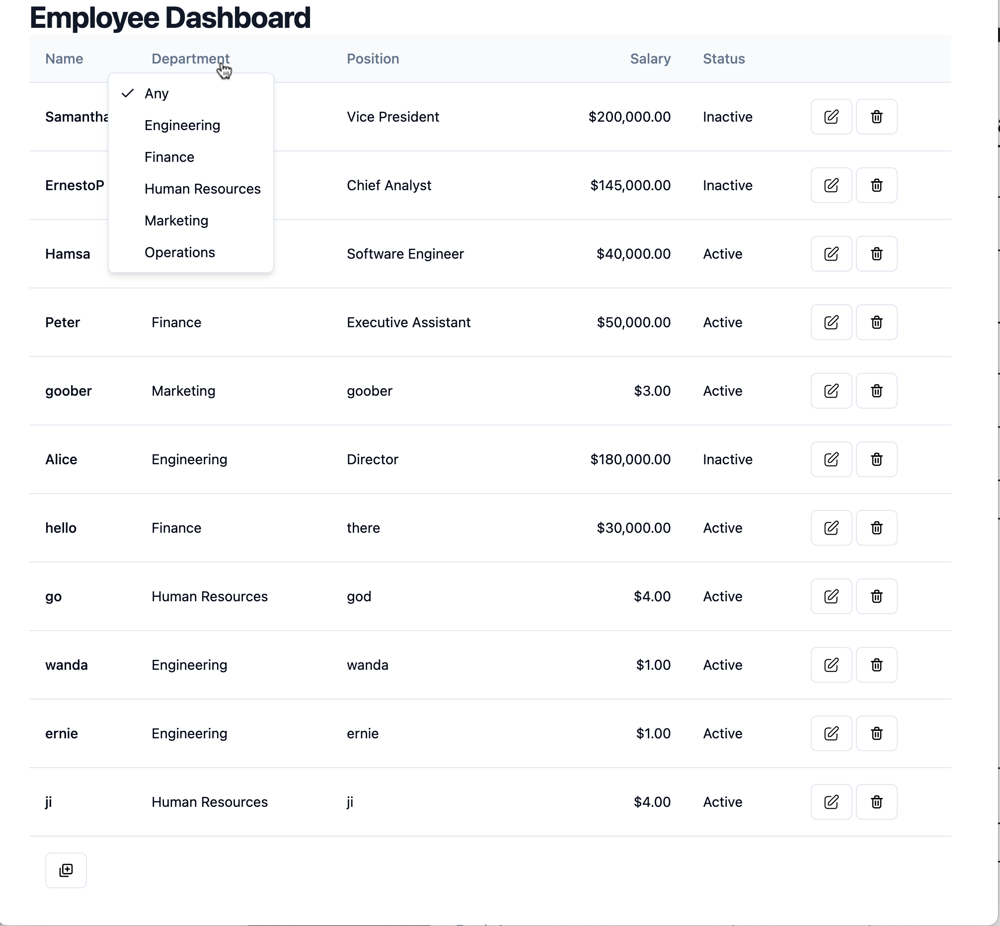

##### Department Drop-down with filter applied

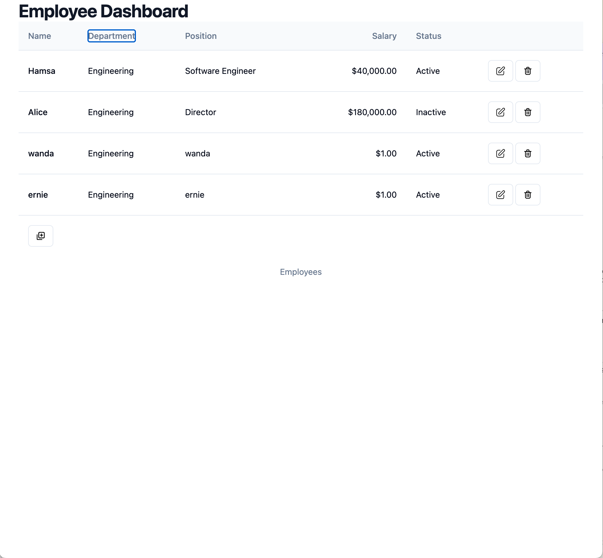

##### Both Department and Status filter applied

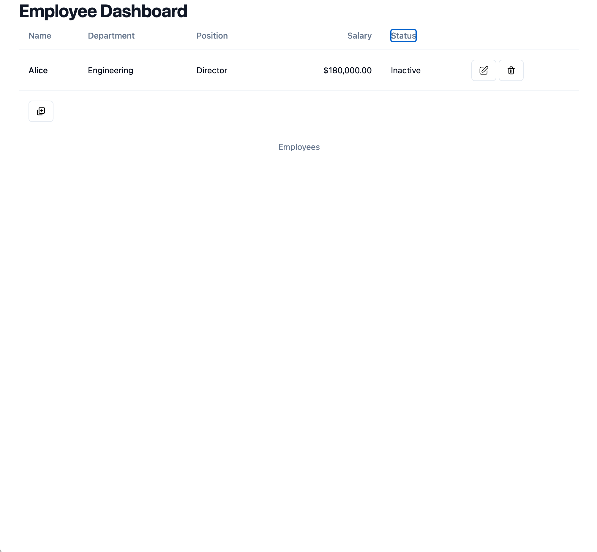

### Edit/Add Dialog

The Add and Edit dialogs share the same component code.

#### Add dialog

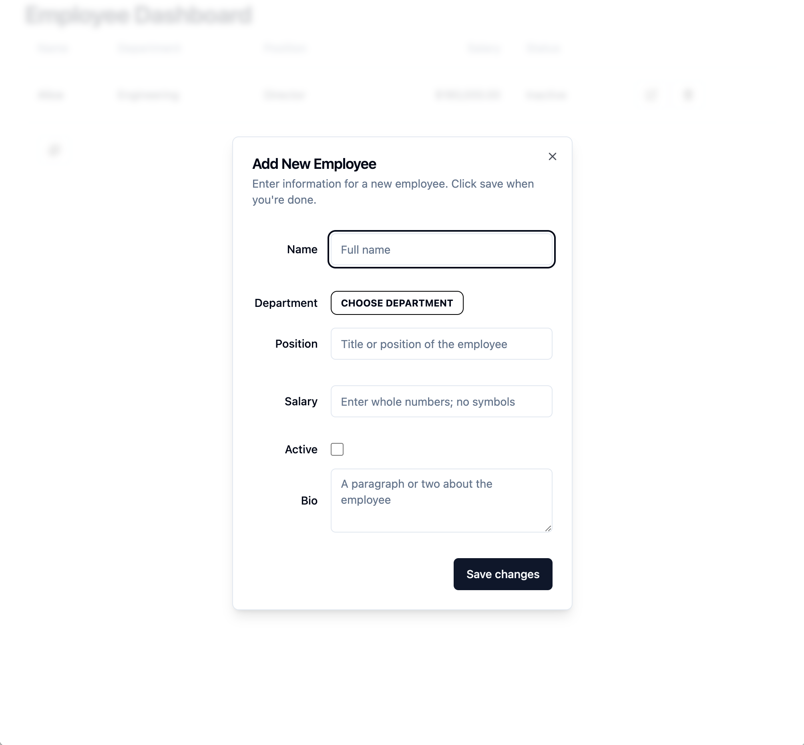

#### Edit dialog

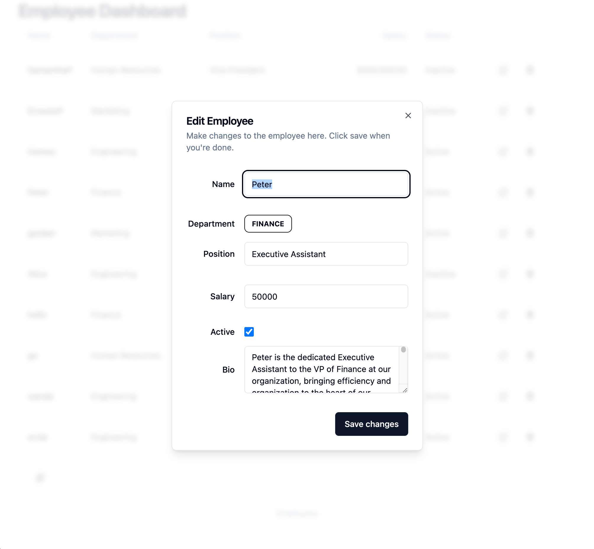

#### Edit Department dropdown

The department dropdown menu re-uses the same code used in the main table view above for the Department filter

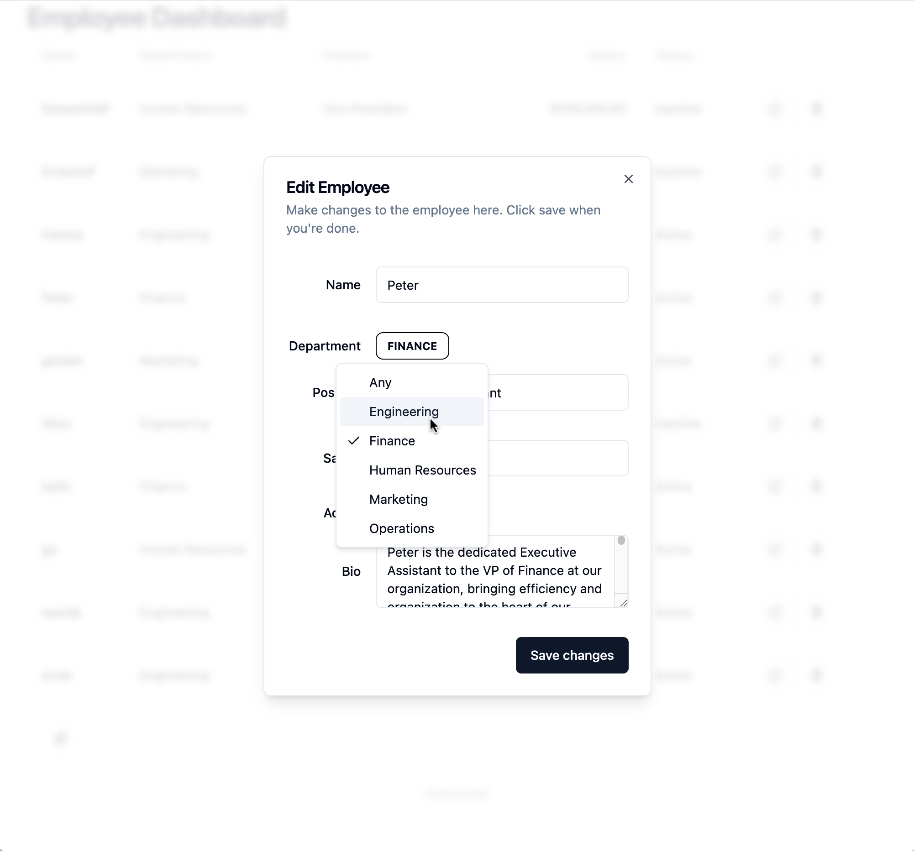

#### Edit Form validation

When unacceptable entries are attempted to be submitted, all errors are highlighted in the dialog and nothing is sent to the backend. 

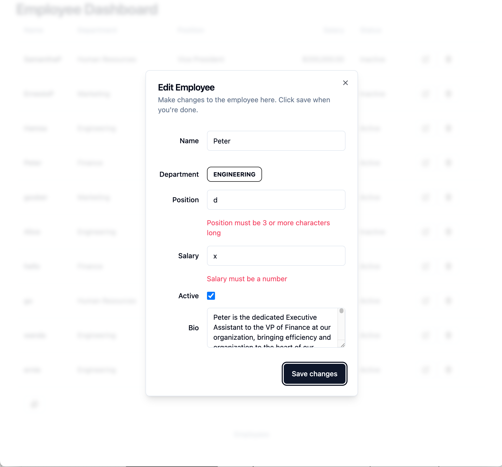

### Delete Dialog

When the delete icon is clicked, a dialog box opens prompting the user to confirm the action. The item is only deleted if the big red "Delete" button is clicked.

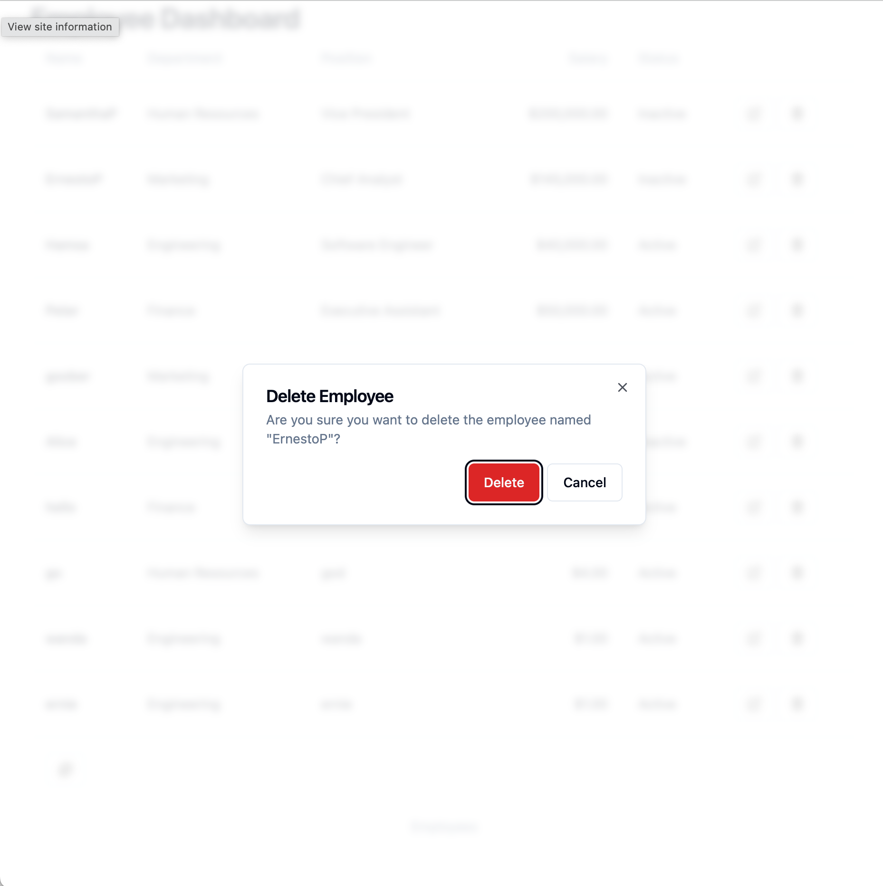
